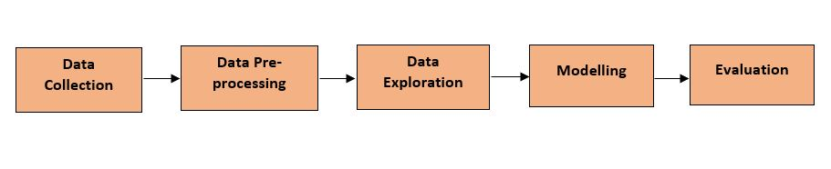
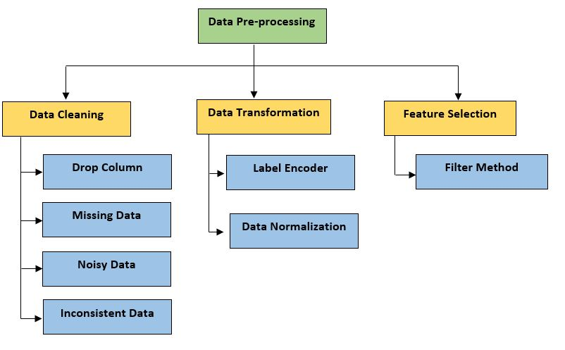
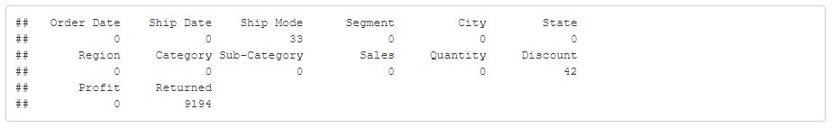
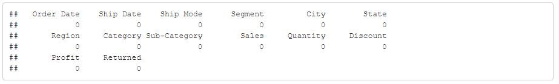
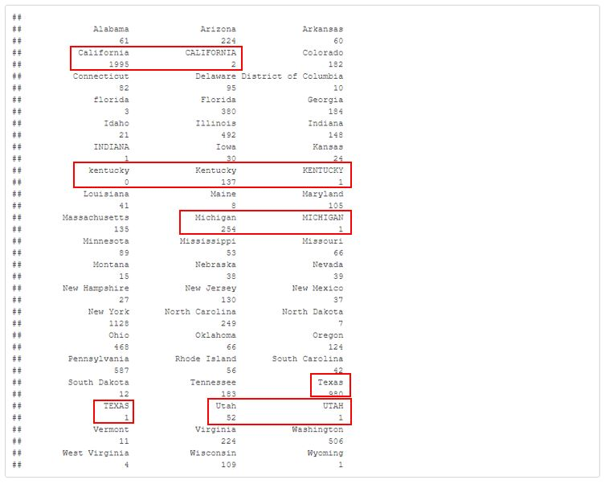
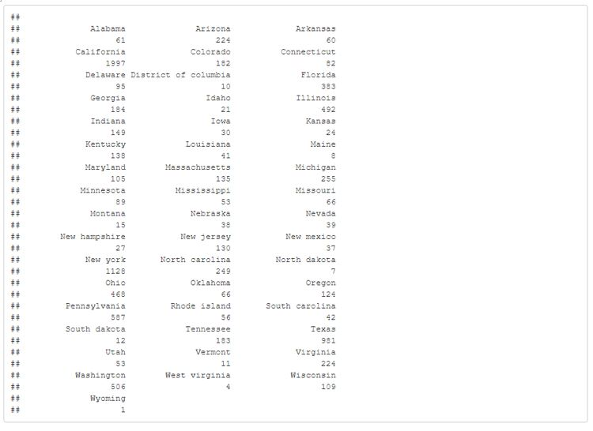

```{r setup, include=FALSE}
knitr::opts_chunk$set(echo = FALSE)
```

```{r xaringan-themer, include=FALSE, warning=FALSE}
library(xaringanthemer)
style_solarized_light()

```

## Project Background

Superstore provides the sale of goods and services to the consumers. Undeniably, there are many superstore company existed in the world. For example, Tesco, Target, Walmart and many more. In conjunction with that matter, this project will also work on the database from the superstore. Plus, in this project, prediction and sales forecasting will be carried out by using machine learning model.


---

## Problem Statement

With growing demands and cut-throat competitions in the market, knowledge is important for the understanding of what works best for the company. In addition to that, good strategic is  also one of the key point for the company, to stay relevant, fighting with the other big superstore company. Hence,superstore attributes like products, regions, categories, customer segments and many others are the few factors that will be studied during this project.

## Project Objective

-  To explore and find pattern out of the shopping attributes of the superstore. 
-  To develop the machine learning model in predicting sales of the superstore.
- To evaluate the machine learning model when predicting the sales of the superstore.

---

## Project Methodology

This project is consisted of 5 steps. They are Data Collection, Data Pre-processing, Data Exploration, Modelling and Evaluation.

```{r, warning=FALSE, error=FALSE, message=FALSE}
library(readxl)
library(tidyverse)
library(dplyr)
library(ggplot2)
library(ggrepel)
library(forcats)
library(scales)
library(superml)
library(corrplot)
library(reshape2)
library(Hmisc)
library(stats)
library(GGally)
library(mlbench)
library(readr)
library(plyr)
```

```{r}
df_order = read_xls('superstorev2.xls', sheet = 'Orders', col_names = TRUE)
df_return = read_xls('superstorev2.xls', sheet='Returns', col_names = TRUE)
df_people = read_xls('superstorev2.xls', sheet='People', col_names = TRUE)
```




---
```{r, warning=FALSE, error=FALSE, message=FALSE}
df = dplyr::full_join(df_order, df_return, by="Order ID")

df$`Order Date` = as.Date.character(df$`Order Date`, format="%Y-%m-%d")
df$`Ship Date` = as.Date(df$`Ship Date`, format="%Y-%m-%d")
```

## Data Collection
The data is collected from the Kaggle Website. The data is consisted of 21 columns with 9,994 number of rows. In addition, in the XLS file, there are 3 sheets:

-   Orders: List of transactions
-   Returns: List of items returned
-   People: List of sales person for West, East, Central and South

All sheet of data are interconnected between one another. Hence, the sheets are combined together into 1 sheet of data that is called, `df`. Sample of the data will be shown on the next slide. 
<br/><br/>The link to the Kaggle website can be obtained below: <br/>
https://www.kaggle.com/datasets/vivek468/superstore-dataset-final?select=Sample+-+Superstore.csv


---

## Sample of the Dataset

This is the 50 samples from the original dataset.
```{r, warning=FALSE, error=FALSE, message=FALSE}
library(rmarkdown)

f <- function() {
  paged_table(head(df, n=50))
}

f()
```

---

## Data Pre-processing

In data pre-processing, there are few activity conducted which include data cleaning, data transformation and feature selection.


---

## Drop Column
The columns that not bring benefits to the analysis are dropped. For example, Row ID, Customer ID, Order ID, Customer Name, Product Name, Postal Code, Product ID, and Country. Country is dropped because there is only one country under that variable, which is America.
```{r, warning=FALSE, error=FALSE, message=FALSE}
drop<-c('Row ID','Order ID','Customer ID','Customer Name','Postal Code', 'Product Name','Product ID','Country')

df <- df[,!(names(df) %in% drop)]

library(rmarkdown)

f <- function() {
  paged_table(head(df, n=50))
}

f()
```
---
## Missing Data

Next, we check for missing value. The data set is checked for any non-availability (NA). This is because missing value is  dirty and might result in affecting our analysis.



Based on the results, we can see that there are few variables that contain NA value. They are Ship Mode, Discount and Returned. Ship Mode has 33 missing values, Discount has 42 missing values and Returned has 9194 missing values. These missing value will be handled accordingly. 

---
class: middle
**Imputation (Using mode & median)** <br />

We know that Ship Mode is in nominal pattern. Hence, we will handle the missing data by using imputation by mode. For Discount, it is a numerical data. Hence, the missing data will be handled by using imputation by median. However, for Returned, the missing value is for the row with 'No' data. Only 'Yes' are filled inside the dataset. Hence, 'No' imputation is done upon the variable.

```{r, warning=FALSE, error=FALSE, message=FALSE}

df<-as.data.frame(df)

getmode <- function(v){
  v=v[nchar(as.character(v))>0]
  uniqv <- unique(v)
  uniqv[which.max(tabulate(match(v, uniqv)))]
}

df[sapply(df, is.character)] <- lapply(df[sapply(df, is.character)], function(x) ifelse(is.na(x) == TRUE, getmode(x), x))
df[sapply(df, is.character)] <- lapply(df[sapply(df, is.character)], as.factor)

df$Discount[is.na(df$Discount)]<-median(df$Discount,na.rm=TRUE)


df$Returned<-df$Returned[is.na(df$Returned)]<-'No'


```


From the results, all columns illustrate 0 from any NA value. This show that all missing value had been handled properly. After missing value is cattered, the pattern of the data is studied.

---
## Noisy Data
**(Numerical data)** <br />
The pattern for the numerical data is studied. The aim is to determine for any irrelevant pattern in the dataset. To do so, histogram is plotted.


From the histogram, there is weird value in Quantity. It cannot be negative because this variable indicate the number of product. So, removing it would be good since the amount of error in this variable is really small.

---
**The rows of the error data are removed:**

```{r}
df <- df[df$Quantity >= 0, ]
hist(df$Quantity)
```
<br />
From the results, it shows that the rows containing error value is removed successfully.

---
## Inconsistent Data

**(Categorical data)** <br />
Categorical data in this dataset includes Ship Mode, Segment, Country, City, State, Region, Category, and Sub-Category. Any weird naming value or redundancy can be determined from this method.



From the results, State have some value redundancy. The case of the letter is not standardized.

---
class: middle

**Standardizing the case of the letters in State:** <br />

```{r, warning=FALSE, error=FALSE, message=FALSE}
df$State<-tolower(df$State)
capFirst <- function(s) {
  paste(toupper(substring(s, 1, 1)), substring(s, 2), sep = "")
}

df$State <- capFirst(df$State)
```
The letters are standardized into the same case of letter.
<br />


From the results, we can see that the data redundancy is catered successfully.

---
## Label Encoder

```{r, warning=FALSE, error=FALSE, message=FALSE}
df$Segment<-factor(df$Segment)
df$Segment<-as.numeric(df$Segment)
df$`Ship Mode`<-factor(df$`Ship Mode`)
df$`Ship Mode`<-as.numeric(df$`Ship Mode`)
df$`Sub-Category`<-factor(df$`Sub-Category`)
df$`Sub-Category`<-as.numeric(df$`Sub-Category`)
df$`Category`<-factor(df$`Category`)
df$`Category`<-as.numeric(df$`Category`)
df$`Region`<-factor(df$`Region`)
df$`Region`<-as.numeric(df$`Region`)
df$`Returned`<-factor(df$`Returned`)
df$`Returned`<-as.numeric(df$`Returned`)
df$`State`<-factor(df$`State`)
df$`State`<-as.numeric(df$`State`)
df$`City`<-factor(df$`City`)
df$`City`<-as.numeric(df$`City`)

library(rmarkdown)

f <- function() {
  paged_table(head(df, n=50))
}

f()

```

---

## Data Normalization
```{r, warning=FALSE, error=FALSE, message=FALSE}
df$Segment <- scale(df$Segment)
df$`Ship Mode` <- scale(df$`Ship Mode`)
df$`Sub-Category` <- scale(df$`Sub-Category`)
df$`Category` <- scale(df$`Category`)
df$`City` <- scale(df$`City`)
df$`State` <- scale(df$`State`)
df$`Region` <- scale(df$`Region`)
df$`Sales` <- scale(df$`Sales`)
df$`Quantity` <- scale(df$`Quantity`)
df$`Discount` <- scale(df$`Discount`)
df$`Profit` <- scale(df$`Profit`)
df$`Returned` <- scale(df$`Returned`)

library(rmarkdown)

f <- function() {
  paged_table(head(df, n=50))
}

f()

```

---
## Feature Selection

